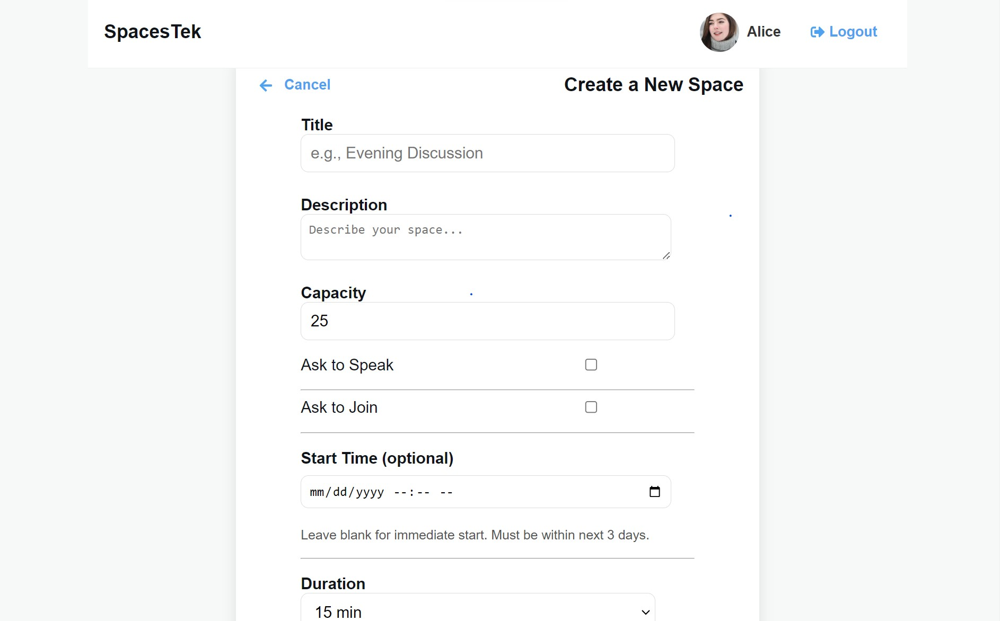
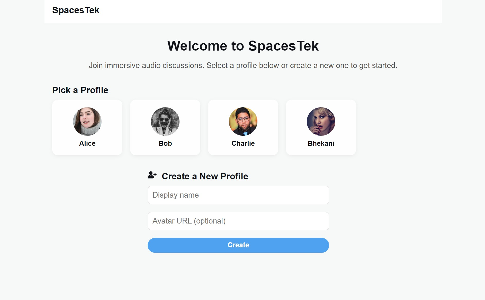
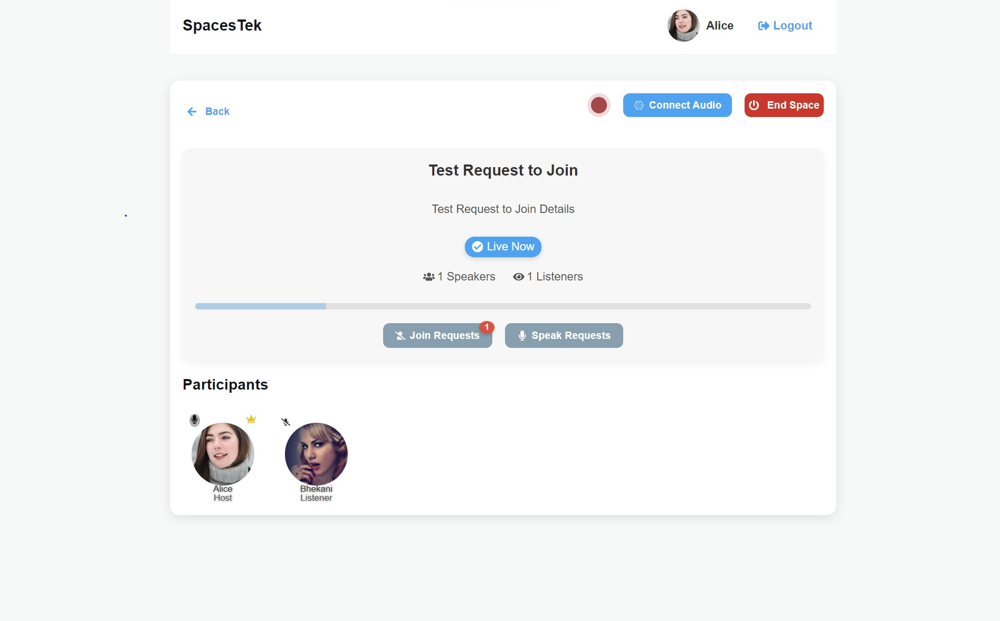
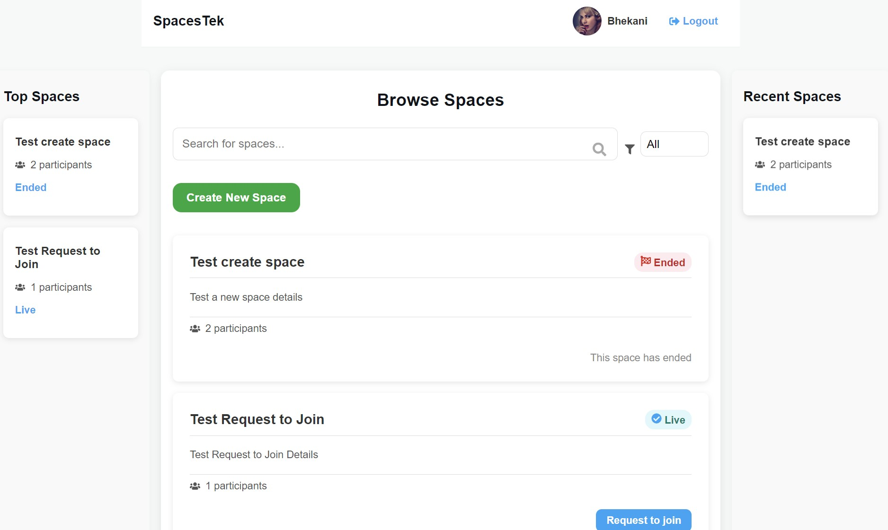

<p align="center">
  
</p>

<p align="center">
  <a href="https://twitter.com/media_sfu">
    
  </a>
  <a href="https://www.mediasfu.com/forums">
    
  </a>
  <a href="https://github.com/MediaSFU">
    
  </a>
  <a href="https://www.mediasfu.com/">
    
  </a>
  <a href="https://www.youtube.com/channel/UCELghZRPKMgjih5qrmXLtqw">
    
  </a>
</p>

MediaSFU offers a cutting-edge streaming experience that empowers users to customize their recordings and engage their audience with high-quality streams. Whether you're a content creator, educator, or business professional, MediaSFU provides the tools you need to elevate your streaming game.

---

# SpacesTekInitial

Welcome to the **SpacesTekInitial** repository! This monorepo contains starter applications for various frameworks to demonstrate how to effectively use the MediaSFU packages.

## SpacesTek Overview

**SpacesTek** is an innovative platform designed to create immersive audio-visual spaces for discussions, events, and collaborations. Whether you're hosting a seminar, joining a casual conversation, or managing a professional meeting, SpacesTek provides the tools to create, manage, and personalize your spaces effortlessly. This repository, **SpacesTekInitial**, offers starter applications for various frameworks, showcasing the integration of the **MediaSFU** package and a lightweight backend to simulate space and user management.

### Key Features

- **Customizable Spaces**: Define capacity, start time, and participant roles like speakers or listeners.
- **Profile Management**: Create and manage user profiles with avatars for a personalized experience.
- **Cross-Platform Compatibility**: Starter applications for React, Angular, Flutter, and React Native (including Expo).
- **Backend Integration**: A modular backend that supports managing spaces and profiles with APIs.

---

## Table of Contents

- [Available Starter Apps](#available-starter-apps)
  - [MediaSFU ReactJS](./mediasfu_reactjs/README.md)
  - [MediaSFU React Native](./mediasfu_react_native/README.md)
  - [MediaSFU React Native Expo](./mediasfu_react_native_expo/README.md)
  - [MediaSFU Flutter](./mediasfu_flutter/README.md)
  - [MediaSFU Angular](./mediasfu_angular/README.md)
- [Backend Service](./backend/README.md)
- [Getting Started](#getting-started)
  - [Clone the Repository](#clone-the-repository)
  - [Choose a Starter App](#choose-a-starter-app)
- [SpacesTek Visual Showcase](#spacestek-visual-showcase)
- [Contributing](#contributing)
- [License](#license)

## Available Starter Apps

Explore the starter application that best fits your development framework:

- **[MediaSFU ReactJS](./mediasfu_reactjs/README.md)**: A web application built with ReactJS demonstrating the integration of MediaSFU packages.
- **[MediaSFU React Native](./mediasfu_react_native/README.md)**: A mobile application for iOS and Android using React Native.
- **[MediaSFU React Native Expo](./mediasfu_react_native_expo/README.md)**: A React Native application powered by Expo for easier development and deployment.
- **[MediaSFU Flutter](./mediasfu_flutter/README.md)**: A cross-platform mobile application built with Flutter.
- **[MediaSFU Angular](./mediasfu_angular/README.md)**: A web application built with Angular showcasing MediaSFU package usage.

---

 
## Backend Service

The SpacesTek backend is a simple, extensible Node.js server that provides RESTful APIs for managing spaces and user profiles. It powers the frontend applications with features like fetching space details, updating user profiles, and saving new spaces. Designed for demonstration purposes, the backend can be extended for production environments.

### Features

- **Space Management**: Create, update, and retrieve spaces with configurable details such as capacity, start time, and duration.
- **User Profile Handling**: Manage user profiles for creating personalized user experiences.
- **Mock Database**: Utilizes a `db.json` file to simulate persistent data storage.
- **Modular Design**: Easily replace the mock database with a real database or external service.

### API Endpoints

| Endpoint       | Description                    | Method |
|----------------|--------------------------------|--------|
| `/api/read`    | Fetch the list of spaces and users. | GET    |
| `/api/write`   | Save or update spaces and users.    | POST   |


## SpacesTek Visual Showcase

Here’s a visual walkthrough of SpacesTek. These images represent various features and user interfaces of the platform:

<div style="display: grid; grid-template-columns: 1fr 1fr; gap: 16px; margin: 20px 0;">
  <div>
    
    <p style="text-align: center;">Create Space</p>
  </div>
  <div>
    
    <p style="text-align: center;">User Login</p>
  </div>
  <div>
    
    <p style="text-align: center;">Space Details</p>
  </div>
  <div>
    
    <p style="text-align: center;">Browse Spaces</p>
  </div>
</div>

---

## Getting Started

### Clone the Repository

To get started, clone the entire repository to your local machine:

```bash
git clone https://github.com/MediaSFU/SpacesTekInitial.git
cd SpacesTekInitial

```

---

2. **Choose Your Framework**:
   - Navigate to the desired application directory (e.g., `mediasfu_angular`, `mediasfu_reactjs`) to begin setup.

---

## Contributing

We welcome contributions to improve SpacesTek! Please read our [Contribution Guidelines](CONTRIBUTING.md) to get started.

---

## License

This project is licensed under the [MIT License](LICENSE).